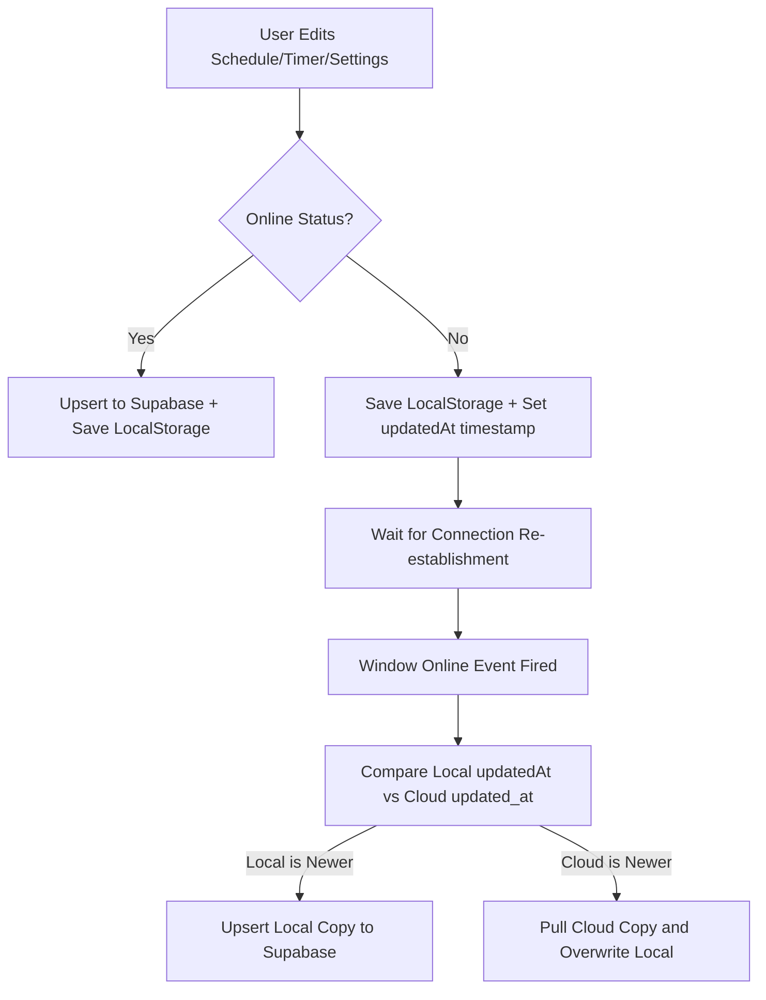

# 📈 Swiss Minimalist Accountability Dashboard

A premium, high-fidelity personal growth, productivity, and sleep tracking web application built with **React**, **Vite**, and **Supabase**. Designed with Swiss neo-minimalist aesthetics, the dashboard helps you plan routines, track tasks, log focus blocks with Pomodoro timers, and monitor physical wellness—all backed by a robust, timestamp-reconciled **offline-first local-to-cloud synchronization layer**.

---

## ✨ Key Features

*   **📅 Today's Agenda & Planner**: Dynamically build, edit, reorder, and check off schedule items, routines, and alerts. Features responsive layouts for both desktop and mobile viewports.
*   **☕ Customizable Pomodoro Timer**: Track deep-work sessions with fully configurable focus and break durations, automatically generating visual time reports.
*   **📊 Analytics & Heatmaps**: Gain interactive insights into focus hours, wasted time, and habit completion stats with visual bar charts and day-by-day contribution heatmaps.
*   **💧 Wellness & Sleep Logs**: Watch sleep curves, log quality indicators, follow curfew winds-downs, and track daily hydration counts.
*   **⚡ Smart Offline-First Sync**: Edits made while offline are stored securely in `localStorage`. Once internet connectivity is restored, a batch queue automatically reconciles changes with Supabase using timestamp conflict resolution (`updatedAt` comparison).

---

## 🛠️ Technology Stack

*   **Core**: React 18 / 19, TypeScript/JavaScript
*   **Build Tool**: Vite
*   **Styling**: Vanilla CSS with Tailwind CSS utilities (configured for high-contrast dark and monochrome themes)
*   **Icons**: Lucide React
*   **Database & Auth**: Supabase (PostgreSQL)

---

## 💾 Database Setup

To configure Supabase cloud syncing:
1. Create a project at [Supabase.com](https://supabase.com).
2. Navigate to the **SQL Editor** in your Supabase dashboard and run the DDL schema commands from the `supabase_schema.sql` file:

```sql
-- 1. DAILY HISTORY TABLE
CREATE TABLE IF NOT EXISTS public.daily_history (
    user_id TEXT DEFAULT 'default' NOT NULL,
    date DATE NOT NULL,
    score INTEGER DEFAULT 0 NOT NULL,
    work_minutes INTEGER DEFAULT 0 NOT NULL,
    wasted_minutes INTEGER DEFAULT 0 NOT NULL,
    habits JSONB DEFAULT '{}'::jsonb NOT NULL,
    schedule_completion NUMERIC(5, 2) DEFAULT 0.00 NOT NULL,
    notes TEXT,
    energy_logs JSONB DEFAULT '[]'::jsonb,
    sleep_data JSONB,
    sessions JSONB DEFAULT '[]'::jsonb,
    created_at TIMESTAMP WITH TIME ZONE DEFAULT timezone('utc'::text, now()) NOT NULL,
    updated_at TIMESTAMP WITH TIME ZONE DEFAULT timezone('utc'::text, now()) NOT NULL,
    PRIMARY KEY (user_id, date)
);

-- 2. TIMER SESSIONS TABLE
CREATE TABLE IF NOT EXISTS public.timer_sessions (
    id BIGINT GENERATED BY DEFAULT AS IDENTITY PRIMARY KEY,
    user_id TEXT DEFAULT 'default' NOT NULL,
    date DATE NOT NULL,
    project TEXT DEFAULT 'Untagged' NOT NULL,
    start_time TIMESTAMP WITH TIME ZONE NOT NULL,
    end_time TIMESTAMP WITH TIME ZONE NOT NULL,
    duration_minutes NUMERIC(6, 2) DEFAULT 0.00 NOT NULL,
    gaps JSONB DEFAULT '[]'::jsonb,
    created_at TIMESTAMP WITH TIME ZONE DEFAULT timezone('utc'::text, now()) NOT NULL
);

-- 3. USER SETTINGS TABLE
CREATE TABLE IF NOT EXISTS public.user_settings (
    user_id TEXT DEFAULT 'default' NOT NULL PRIMARY KEY,
    settings JSONB DEFAULT '{}'::jsonb NOT NULL,
    updated_at TIMESTAMP WITH TIME ZONE DEFAULT timezone('utc'::text, now()) NOT NULL
);

-- Enable RLS and setup permissive policies
ALTER TABLE public.daily_history ENABLE ROW LEVEL SECURITY;
ALTER TABLE public.timer_sessions ENABLE ROW LEVEL SECURITY;
ALTER TABLE public.user_settings ENABLE ROW LEVEL SECURITY;

CREATE POLICY "Enable all access for daily_history" ON public.daily_history FOR ALL USING (true) WITH CHECK (true);
CREATE POLICY "Enable all access for timer_sessions" ON public.timer_sessions FOR ALL USING (true) WITH CHECK (true);
CREATE POLICY "Enable all access for user_settings" ON public.user_settings FOR ALL USING (true) WITH CHECK (true);
```

---

## 🚀 Getting Started

### Prerequisites

*   Node.js (v18+)
*   npm

### Installation

1. Clone the repository:
    ```bash
    git clone https://github.com/aashishjaiswal1103/schedule-tracker-.git
    cd schedule-tracker-
    ```

2. Install dependencies:
    ```bash
    npm install
    ```

3. Create a `.env` file in the root directory:
    ```env
    VITE_SUPABASE_URL=your-supabase-url
    VITE_SUPABASE_ANON_KEY=your-supabase-anon-key
    ```
    *(Note: These environment values can also be entered dynamically in the app's Settings panel for instant sync).*

4. Run the local development server:
    ```bash
    npm run dev
    ```

5. Build for production:
    ```bash
    npm run build
    ```

---

## 🔄 Offline Reconciliation Architecture

The application implements a local-first architecture to ensure user flow is never interrupted by connectivity lag:


